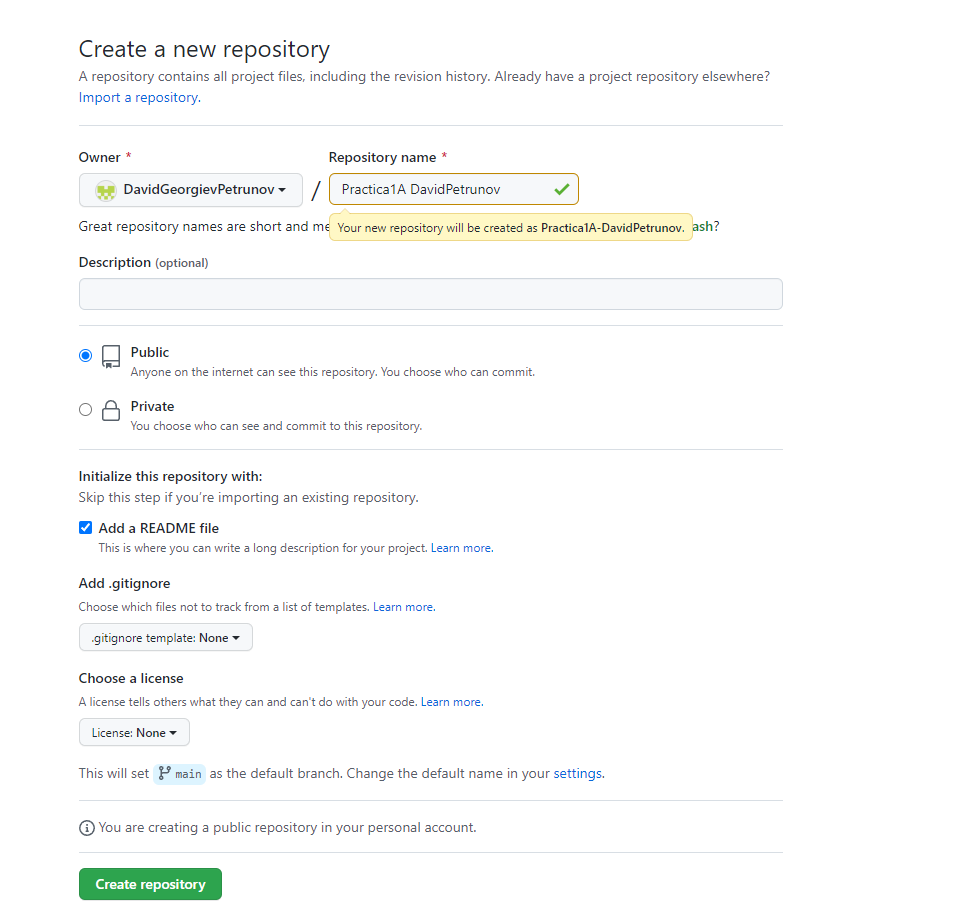
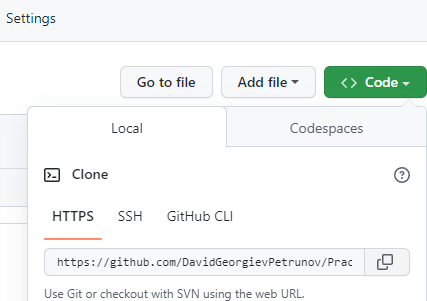
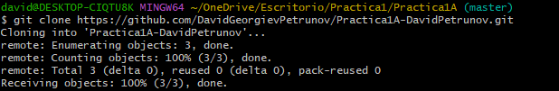
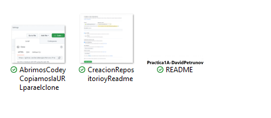
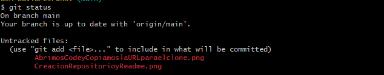
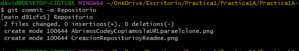
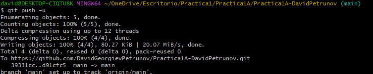

# Practica1A-DavidPetrunov

Creamos un repositorio y un readme.

Copiamos la url.

Abrimos la terminal y hacemos el clone.

Añadimos las capturas anteriores (en esta solo salen la primera y segunda)

Comprobamos con status que las capturas estan dentro del repositorio clonado

Hacemos un add

Comprobamos que ha funcionado

Hacemos un commit

Ahora subimos el commit a github, (en la foto lo que he subido ha sido el commit con dos capturas, luego he echo otro con las capturas que he ido haciendo)

